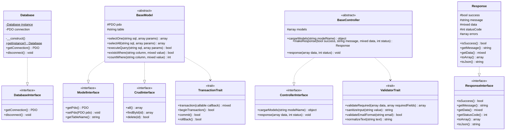
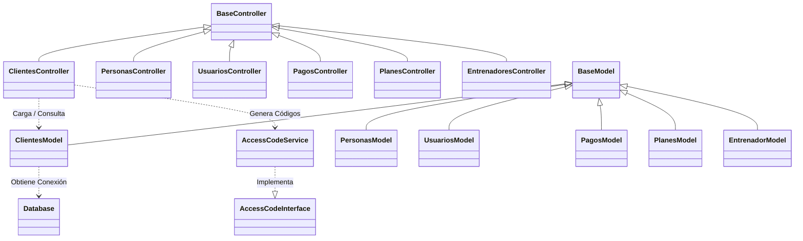

# 🏋️‍♂️ Rockstar GYM — Sistema Integral de Gestión para Gimnasios

> **Arquitectura MVC Refactorizada con Programación Orientada a Objetos (POO), Principios SOLID, Patrones de Diseño y Tipado Fuerte en PHP 8.x**

---

## 📑 Tabla de Contenidos
1. [Visión General del Proyecto](#-visión-general-del-proyecto)
2. [Arquitectura del Sistema](#-arquitectura-del-sistema)
3. [Pilares de la Programación Orientada a Objetos (POO)](#-pilares-de-la-programación-orientada-a-objetos-poo)
   - [1. Abstracción](#1-abstracción)
   - [2. Encapsulamiento](#2-encapsulamiento)
   - [3. Herencia](#3-herencia)
   - [4. Polimorfismo](#4-polimorfismo)
4. [Principios SOLID Aplicados](#-principios-solid-aplicados)
5. [Patrones de Diseño Implementados](#-patrones-de-diseño-implementados)
6. [Estructura del Código y Componentes](#-estructura-del-código-y-componentes)
7. [Diagramas de Clases y Flujos (Mermaid)](#-diagramas-de-clases-y-flujos-mermaid)
8. [Módulos del Sistema](#-módulos-del-sistema)
9. [Requisitos e Instalación](#-requisitos-e-instalación)
10. [Buenas Prácticas y Guía de Extensión](#-buenas-prácticas-y-guía-de-extensión)

---

## 🎯 Visión General del Proyecto

**Rockstar GYM** es una plataforma web completa de administración y control operativo para centros de entrenamiento físico, gimnasios y complejos deportivos. El sistema gestiona integralmente el ciclo de vida del usuario: desde la administración de personas, clientes, entrenadores, membresías, planes y entrenamientos, hasta la asignación de horarios, control de acceso por roles/permisos y registro de pagos.

En esta versión, el núcleo del software ha sido **completamente refactorizado**, elevando su base técnica desde un enfoque estructurado tradicional hacia una **arquitectura empresarial orientada a objetos (OOP)** robusta, modular, desacoplada y tipada en PHP 8+, manteniendo el 100% de compatibilidad con las vistas existentes.

---

## 🏗 Arquitectura del Sistema

El proyecto sigue una arquitectura **MVC (Modelo - Vista - Controlador)** potenciada con:
- **Capa de Contratos / Interfaces (`app/interfaces/`)**: Define las firmas canónicas y comportamientos obligatorios para los componentes.
- **Capa de Composición Horizontal / Traits (`app/traits/`)**: Inyecta capacidades transversales (validación, sanitización y transacciones atómicas) sin saturar la jerarquía de herencia.
- **Capa de Núcleo / Core (`app/core/`)**: Administra conexiones persistentes mediante el patrón *Singleton* y normaliza las respuestas HTTP/JSON con *Value Objects*.
- **Capa de Servicios de Dominio (`app/services/`)**: Aísla la lógica de negocio especializada (p. ej., algoritmos de generación de códigos de acceso).
- **Autocargador Inteligente (`config/init.php` / Composer PSR-4)**: Provee resolución dinámica de clases tanto con espacio de nombres (`App\...`) como con soporte retrocompatible.

```
                  ┌─────────────────────────────────┐
                  │       Petición del Cliente      │
                  │   (Navegador / AJAX / Fetch)    │
                  └────────────────┬────────────────┘
                                   │
                                   ▼
                  ┌─────────────────────────────────┐
                  │    Router / Vistas Públicas     │
                  │    (public/*.php / views/)      │
                  └────────────────┬────────────────┘
                                   │
                                   ▼
                  ┌─────────────────────────────────┐
                  │       Controlador (MVC)         │
                  │   (Extiende BaseController)     │
                  │    + Usa ValidatorTrait         │
                  └────────┬──────────────┬─────────┘
                           │              │
        ┌──────────────────┘              └──────────────────┐
        ▼                                                    ▼
┌───────────────────────────────┐            ┌───────────────────────────────┐
│     Servicio de Dominio       │            │         Modelo (MVC)          │
│   (p. ej. AccessCodeService)  │            │     (Extiende BaseModel)      │
│  Implementa AccessCodeInterface│           │    + Usa TransactionTrait     │
└───────────────────────────────┘            └───────────────┬───────────────┘
                                                             │
                                                             ▼
                                             ┌───────────────────────────────┐
                                             │       Base de Datos (PDO)     │
                                             │     Database::getInstance()   │
                                             └───────────────────────────────┘
```

---

## 💎 Pilares de la Programación Orientada a Objetos (POO)

### 1. Abstracción
La abstracción permite modelar conceptos del mundo real o de la arquitectura del software exponiendo únicamente los detalles esenciales y ocultando la complejidad operativa.

* **Interfaces Formales**:
  - `DatabaseInterface`: Abstrae la obtención y gestión de la conexión PDO.
  - `ModelInterface` & `CrudInterface`: Abstraen la persistencia de datos y las operaciones de consulta estándar (`all`, `findById`, `delete`, `getTableName`).
  - `ControllerInterface`: Abstrae el ciclo de vida de los controladores, la carga de submódulos (`cargarModels`) y la emisión de respuestas (`response`).
  - `ResponseInterface`: Abstrae la estructura canónica de respuesta (`isSuccess`, `getMessage`, `getData`, `toJson`, `toArray`).
  - `AccessCodeInterface`: Abstrae la estrategia de generación y verificación de códigos de acceso de clientes.
* **Clases Base Abstractas**:
  - `BaseModel`: Provee métodos template para ejecución segura de queries (`selectOne`, `selectAll`, `executeQuery`, `existsWhere`, `countWhere`, `transaction`) aislando las llamadas directas a PDO.
  - `BaseController`: Provee métodos estandarizados para validación (`validateRequired`, `sanitizeInput`, `validateEmailFormat`), renderizado y emisión JSON (`response`, `makeResponse`).

```php
// Ejemplo: Contrato de abstracción para modelos CRUD
interface CrudInterface {
    public function all(): array;
    public function findById(int|string $id): ?array;
    public function delete(int|string $id): bool;
}
```

---

### 2. Encapsulamiento
El encapsulamiento protege el estado interno de los objetos y previene modificaciones no controladas desde el exterior mediante modificadores de acceso (`private`, `protected`, `public`) y métodos accesores (*getters* e *inmutabilidad*).

* **Conexión a Base de Datos Segura**: En `Database`, el constructor `__construct()` y el método `__clone()` son **privados**, impidiendo la instanciación desordenada y asegurando que solo `Database::getInstance()` pueda proveer el objeto de conexión.
* **Protección de Atributos de Persistencia**: En `BaseModel`, la instancia `$pdo` y el nombre de la tabla `$table` son `protected`, accesibles solo por las clases hijas especializadas a través de `getPdo()` y `setTableName()`.
* **Value Object `Response` Inmutable**: Las respuestas generadas por los controladores encapsulan su estado (`$success`, `$message`, `$data`, `$statusCode`, `$errors`) sin exponer setters públicos arbitrarios.

```php
// Ejemplo: Encapsulamiento en el Value Object Response
namespace App\Core;

class Response implements \App\Interfaces\ResponseInterface, \JsonSerializable {
    public function __construct(
        protected bool $success = true,
        protected string $message = '',
        protected mixed $data = null,
        protected int $statusCode = 200,
        protected array $errors = []
    ) {}

    public function isSuccess(): bool { return $this->success; }
    public function getMessage(): string { return $this->message; }
    public function getData(): mixed { return $this->data; }
}
```

---

### 3. Herencia
La herencia permite la reutilización de código y la especialización jerárquica, donde las clases derivadas heredan comportamientos fundamentales de sus clases padre.

* **Jerarquía de Modelos**:
  ```
  BaseModel (Implementa ModelInterface, CrudInterface, usa TransactionTrait)
    ├── PersonasModel
    ├── ClientesModel
    ├── EntrenadorModel
    ├── UsuariosModel
    ├── PagosModel
    ├── PlanesModel
    ├── EntrenamientosModel
    ├── HorariosModel
    ├── HorarioEntrenamientoModel
    ├── RolesModel
    ├── PermisosModel
    └── LoginModel
  ```
* **Jerarquía de Controladores**:
  ```
  BaseController (Implementa ControllerInterface, usa ValidatorTrait)
    ├── PersonasController
    ├── ClientesController
    ├── EntrenadoresController
    ├── UsuariosController
    ├── PagosController
    ├── PlanesController
    ├── EntrenamientosController
    ├── HorariosController
    ├── HorarioEntrenamientoController
    ├── RolesController
    ├── PermisosController
    └── LoginController
  ```

```php
// Ejemplo: Herencia aplicada en ClientesModel
class ClientesModel extends BaseModel {
    protected string $table = 'clientes';

    public function getClientesCompletos(): array {
        $sql = "SELECT c.*, p.nombre, p.apellido, p.cedula, p.email, p.telefono
                FROM {$this->table} c
                INNER JOIN personas p ON c.id_persona = p.id
                ORDER BY c.id DESC";
        return $this->selectAll($sql); // Reutiliza método heredado de BaseModel
    }
}
```

---

### 4. Polimorfismo
El polimorfismo permite que distintas clases respondan de manera diferente al mismo mensaje o invocación de método a través de interfaces compartidas o sobreescritura (*override*).

* **Polimorfismo en Respuestas (`ResponseInterface`)**:
  Cualquier componente del sistema puede procesar respuestas polimórficas llamando a `toArray()` o `toJson()`, garantizando interoperabilidad independientemente del origen de los datos.
* **Polimorfismo en Generación de Códigos (`AccessCodeInterface`)**:
  La interfaz `AccessCodeInterface` permite intercambiar la estrategia de generación de identificadores de clientes (por ejemplo, cambiar de un prefijo alfanumérico a códigos QR, UUIDv4 o hashes biométricos) sin modificar una sola línea de código en los controladores ni en las vistas.
* **Polimorfismo en Persistencia (`CrudInterface`)**:
  Los métodos estándar como `all()`, `findById($id)` y `delete($id)` están presentes en todos los modelos, permitiendo que componentes genéricos consuman entidades de manera uniforme.

```php
// Intercambiabilidad polimórfica del servicio de códigos
interface AccessCodeInterface {
    public function generateAccessCode(string $prefix = 'RSG', int $length = 8): string;
    public function validateAccessCode(string $code): bool;
}

class AccessCodeService implements AccessCodeInterface {
    public function generateAccessCode(string $prefix = 'RSG', int $length = 8): string {
        $characters = '0123456789ABCDEFGHJKLMNPQRSTUVWXYZ';
        // Generación criptográficamente segura
        $random = '';
        for ($i = 0; $i < $length; $i++) {
            $random .= $characters[random_int(0, strlen($characters) - 1)];
        }
        return $prefix . '-' . $random;
    }
}
```

---

## 📐 Principios SOLID Aplicados

| Principio | Definición | Implementación en Rockstar GYM |
|---|---|---|
| **S** — Single Responsibility | Una clase debe tener una sola razón para cambiar. | • `Database`: Conexión única PDO.<br>• `ValidatorTrait`: Reglas de validación y limpieza.<br>• `TransactionTrait`: Transaccionalidad ACID.<br>• `AccessCodeService`: Generación de códigos.<br>• Modelos: Solo persistencia SQL.<br>• Controladores: Orquestación de peticiones y respuestas. |
| **O** — Open / Closed | Abierto para extensión, cerrado para modificación. | Las clases base (`BaseModel`, `BaseController`) pueden extenderse para agregar nuevos modelos (ej. `MembresiasModel`) sin modificar el núcleo existente. |
| **L** — Liskov Substitution | Los subtipos deben ser sustituibles por sus tipos base. | Cualquier subclase de `BaseModel` puede sustituir a `ModelInterface` o `CrudInterface` sin alterar la corrección del programa. |
| **I** — Interface Segregation | Múltiples interfaces específicas son mejores que una sobrecargada. | Se crearon contratos pequeños y atómicos: `DatabaseInterface`, `ModelInterface`, `CrudInterface`, `ControllerInterface`, `ResponseInterface`, `AccessCodeInterface`, `SeederInterface`. |
| **D** — Dependency Inversion | Depender de abstracciones, no de concreciones. | Los modelos aceptan inyección de dependencias mediante `$model->setPdo($pdo)` y los controladores dependen de `ControllerInterface` y `ResponseInterface`. |

---

## 🎨 Patrones de Diseño Implementados

### 1. Singleton (Creacional)
Garantiza una única instancia de la conexión a base de datos en toda la ejecución, reutilizando el socket de PDO y reduciendo el consumo de memoria y conexiones a MySQL.
- **Archivo**: `app/core/Database.php`

### 2. Strategy (Comportamiento)
Permite desacoplar el algoritmo de generación de códigos de acceso de cliente mediante `AccessCodeInterface` y `AccessCodeService`.
- **Archivos**: `app/interfaces/AccessCodeInterface.php`, `app/services/AccessCodeService.php`

### 3. Template Method (Comportamiento)
`BaseModel` define la estructura invariable de las consultas con *Prepared Statements* y manejo de excepciones en `selectOne()`, `selectAll()`, `executeQuery()`, y delega en los modelos concretos la definición de las tablas y consultas particulares.
- **Archivo**: `app/models/models.php`

### 4. Value Object / Data Transfer (Estructural)
`Response` actúa como un objeto de transferencia inmutable para respuestas unificadas y serializables a JSON.
- **Archivo**: `app/core/Response.php`

### 5. Trait Composition (Estructural)
Inyección de capacidades de validación y transaccionalidad mediante `ValidatorTrait` y `TransactionTrait`, evitando los problemas del *Diamond Problem* y la herencia múltiple.
- **Archivos**: `app/traits/ValidatorTrait.php`, `app/traits/TransactionTrait.php`

---

## 📂 Estructura del Código y Componentes

```text
rockstar_gym/
├── app/
│   ├── controllers/               # Controladores de la aplicación
│   │   ├── controllers.php        # BaseController (Clase Base)
│   │   ├── clientesController.php
│   │   ├── personasController.php
│   │   ├── userController.php
│   │   ├── rolesController.php
│   │   ├── permisosController.php
│   │   ├── entrenadoresController.php
│   │   ├── entrenamientosController.php
│   │   ├── horariosController.php
│   │   ├── horarioEntrenamientoController.php
│   │   ├── planesController.php
│   │   ├── pagosController.php
│   │   └── loginController.php
│   │
│   ├── models/                    # Capa de datos y persistencia
│   │   ├── models.php             # BaseModel (Clase Base)
│   │   ├── personasModels.php
│   │   ├── clientesModel.php
│   │   ├── usuariosModel.php
│   │   ├── rolesModel.php
│   │   ├── permisosModel.php
│   │   ├── entrenadorModel.php
│   │   ├── entrenamientosModel.php
│   │   ├── horariosModel.php
│   │   ├── horarioEntrenamientoModel.php
│   │   ├── planesModel.php
│   │   ├── pagosModel.php
│   │   └── loginModel.php
│   │
│   ├── interfaces/                # Contratos formales del sistema
│   │   ├── DatabaseInterface.php
│   │   ├── ModelInterface.php
│   │   ├── CrudInterface.php
│   │   ├── ControllerInterface.php
│   │   ├── ResponseInterface.php
│   │   ├── AccessCodeInterface.php
│   │   └── SeederInterface.php
│   │
│   ├── traits/                    # Capacidades horizontales reutilizables
│   │   ├── ValidatorTrait.php     # Sanitización y validación estricta
│   │   └── TransactionTrait.php   # Manejo atómico de transacciones ACID
│   │
│   ├── core/                      # Núcleo del sistema
│   │   ├── Database.php           # Singleton PDO
│   │   ├── Response.php           # Objeto de respuesta JSON/Array
│   │   └── conn.php               # Puente retrocompatible de conexión
│   │
│   ├── services/                  # Servicios de lógica de negocio
│   │   └── AccessCodeService.php  # Estrategia de códigos de acceso
│   │
│   └── seeders/                   # Sembradores de datos de prueba
│       ├── seeder.php             # BaseSeeder
│       ├── rolSeeder.php
│       ├── personaSeeder.php
│       ├── usuarioSeeder.php
│       └── permisoSeeder.php
│
├── config/
│   ├── init.php                   # Constantes globales + Autocargador PSR-4 / Fallback
│   └── administracion.sql         # Esquema de base de datos MySQL
│
├── public/                        # Punto de entrada HTTP y recursos estáticos
├── views/                         # Vistas del sistema (Blade/PHP)
├── components/                    # Componentes modulares de interfaz
├── composer.json                  # Definición de dependencias y namespace App\
└── README.md                      # Documentación técnica completa
```

---

## 📊 Diagramas de Clases y Flujos (Mermaid)

### Diagrama de Clases: Núcleo e Interfaces



### Diagrama de Relaciones: Modelos y Controladores



---

## 📦 Módulos del Sistema

1. **Gestión de Personas**: Registro de datos biográficos base (cédula, nombre, apellido, teléfono, email).
2. **Gestión de Clientes**: Registro con asignación de código de acceso automático vía `AccessCodeService`, vinculación a personas y estado de membresía.
3. **Gestión de Entrenadores**: Control de especialidades, experiencia, tarifas y asociación con personas.
4. **Gestión de Usuarios, Roles y Permisos**: Sistema RBAC (*Role-Based Access Control*) con autenticación segura (`password_hash`), asignación modular de permisos por vista/acción.
5. **Gestión de Planes y Membresías**: Configuración de planes mensuales, trimestrales, anuales con costos y duraciones.
6. **Gestión de Entrenamientos y Horarios**: Catálogo de disciplinas (Crossfit, Cardio, Musculación, etc.) y asignación de franjas horarias y días de la semana.
7. **Gestión de Pagos**: Registro transaccional de pagos de clientes con actualización automática de fechas de vencimiento de membresía.

---

## 🚀 Requisitos e Instalación

### Requisitos Previos
- **PHP**: 8.0 o superior (compatible y probado con PHP 8.4)
- **Extensiones PHP**: `pdo`, `pdo_mysql`, `json`, `mbstring`
- **Base de Datos**: MySQL 5.7+ o MariaDB 10.3+
- **Servidor Web**: Apache (WampServer, XAMPP, Laragon) o Nginx
- **Composer**: Para resolución de autoloading PSR-4 (opcional, incluye fallback nativo)

### Pasos de Instalación

1. **Clonar / Ubicar el proyecto**:
   Coloca la carpeta en el directorio raíz de tu servidor web (ej. `c:\wamp64\www\rockstar_gym` o `/var/www/html/rockstar_gym`).

2. **Crear e Importar la Base de Datos**:
   Crea la base de datos `rockstar` en tu gestor MySQL e importa el archivo:
   ```sql
   config/administracion.sql
   ```

3. **Configurar las Credenciales**:
   Abre el archivo [`config/init.php`](file:///c:/wamp64/www/rockstar_gym/config/init.php) y verifica las constantes de conexión:
   ```php
   define('BD_HOST', 'localhost');
   define('BD_NAME', 'rockstar');
   define('BD_USER', 'root');
   define('BD_PASS', '');
   define('BD_PORT', 3306);
   define('URL_BASE', 'http://localhost/rockstar_gym');
   ```

4. **Sembrar Datos Iniciales (Seeders)**:
   Puedes ejecutar el orquestador general de seeders desde la terminal:
   ```bash
   php app/seeders/runSeeders.php
   ```

### 🔑 Credenciales de Acceso por Defecto (Seeders)

Tras ejecutar los seeders, los siguientes usuarios quedan disponibles para iniciar sesión:

| Rol | Correo / Identidad | Alias / Cédula | Contraseña | Permisos |
|---|---|---|---|---|
| **Root** | `alexmadrid326@gmail.com` | `root` o `27391753` | `Cliente2026*` | Acceso Total a todos los módulos y seguridad |
| **Administrador** | `jose.altuve98@gmail.com` | `admin` o `27790292` | `Cliente2026*` | Gestión operativa, usuarios, pagos y reportes |
| **Administrador** | `adri.valen.gp@hotmail.com` | `25641157` | `Cliente2026*` | Gestión operativa y pagos |

> [!TIP]
> El sistema de autenticación admite el inicio de sesión utilizando el **correo electrónico**, el **alias de rol** (`root` / `admin`) o la **cédula de identidad** asociada.

5. **Iniciar la Aplicación**:
   Accede desde tu navegador a:
   ```text
   http://localhost/rockstar_gym/public/
   ```

---

## 🛠 Buenas Prácticas y Guía de Extensión

### ¿Cómo crear un nuevo Modelo?
1. Crea tu archivo en `app/models/MiNuevoModel.php` (o con alias retrocompatible `miNuevoModel.php`).
2. Hereda de `BaseModel` y define la propiedad `$table`:
   ```php
   <?php
   namespace App\Models;

   use App\Core\BaseModel;

   class MiNuevoModel extends BaseModel {
       protected string $table = 'mi_tabla';

       public function obtenerActivos(): array {
           return $this->selectAll("SELECT * FROM {$this->table} WHERE estado = 1");
       }
   }
   ```

### ¿Cómo crear un nuevo Controlador?
1. Crea tu archivo en `app/controllers/MiNuevoController.php`.
2. Hereda de `BaseController` y utiliza los métodos heredados:
   ```php
   <?php
   namespace App\Controllers;

   use App\Core\BaseController;

   class MiNuevoController extends BaseController {
       public function index(): void {
           $modelo = $this->cargarModels('MiNuevoModel');
           $datos = $modelo->obtenerActivos();
           $this->response(['status' => true, 'data' => $datos]);
       }
   }
   ```

---

## 👨‍💻 Créditos y Autoría
Proyecto desarrollado y refactorizado con estándares de ingeniería de software moderna, enfocado en escalabilidad, robustez y máxima calidad académica.
